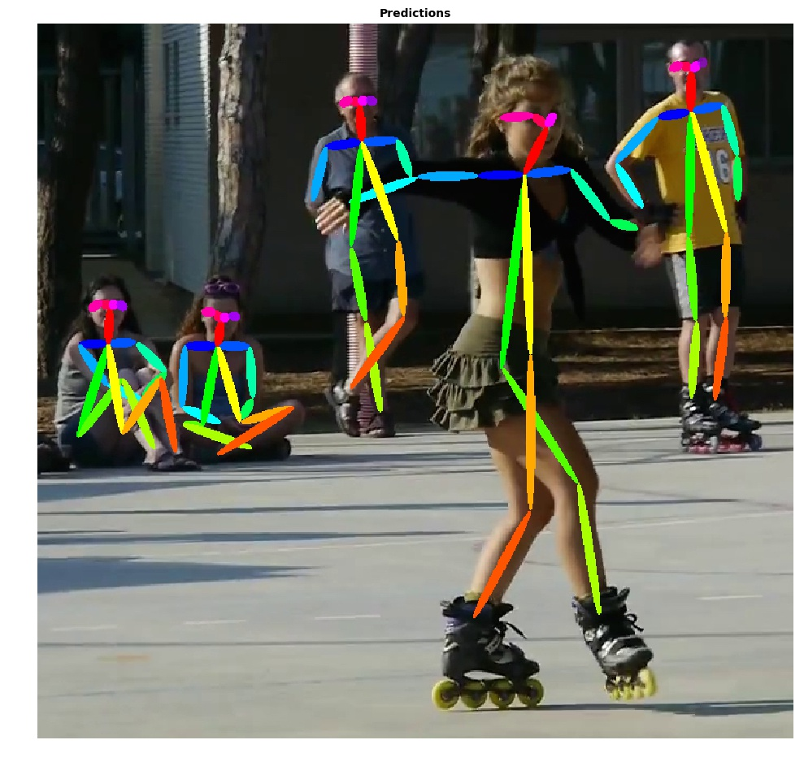

# caffe2-pose-estimation

This repo is a caffe2 implementation of [Realtime Multi-Person Pose Estimation](https://github.com/ZheC/Realtime_Multi-Person_Pose_Estimation).

## Prerequisites

Tested on Ubuntu 16.04 LTS with CUDA 8.0, Cudnn5.1 and Python 2.7.

Assuming the NVIDIA drivers, CUDA 8.0, and Cudnn5.1.10 are installed successfully.
Installing some dependencies for the installation of Caffe framework.
Please refer to the installation steps in the [Caffe2 installation guide](https://caffe2.ai/docs/getting-started.html?platform=ubuntu&configuration=compile).

## Install

Clone the repo.

```bash
$ git clone https://www.github.com/eddieyi/caffe2-pose-estimation
$ cd caffe2-pose-estimation
```

## Download Pretrained Model

Then go to folder 'models/' and run the download script:

```bash
$ cd models/
$ bash download.sh
```

If the automatic download fails, you may manually download the model from [GoogleDrive](https://drive.google.com/open?id=1Ft0Pd4-aKQ0rLx3J4f5Wf4ykf7I8tsO1) or [BaiduYun](https://pan.baidu.com/s/1zkwETLjTQAdaALzWy5IaCg) and then put it in the folder 'models/'.

The pretrained model is converted from the original Caffe [model](http://posefs1.perception.cs.cmu.edu/Users/ZheCao/pose_iter_440000.caffemodel) using the [converting tool of Detectron](https://github.com/facebookresearch/Detectron/blob/master/tools/pickle_caffe_blobs.py).

## Inference

To run inference on a directory of image files, you can use the 'infer.py' script. For example, execute the following commands (in the main folder):

```bash
python2 infer.py --image-ext jpg
```

## Saving GPU Memory Consumption
To reduce the GPU memory consumption, the function 'optimize_memory' is implemented in this script. It deploys the library 'memonger' of Caffe2, which can release the blob of an OP when the computation of this OP is finished. With this function, for an image with the height of 368, the GPU memory utilization should be around 1.2 GB, which is about **2~3** times less than the original Caffe implementation.

Here's an example of a prediction you should expect to see.

<div align="center">
    
    <p>Example pose estimation output</p>
</dev>

**Notes:** The first inference will be slower than the rest due to the program needs to load the model to the GPU memory.

##

## References

[1] https://github.com/ZheC/Realtime_Multi-Person_Pose_Estimation

[2] https://github.com/facebookresearch/Detectron

[3] https://github.com/kevinlin311tw/keras-openpose-reproduce

[4] https://caffe2.ai/


